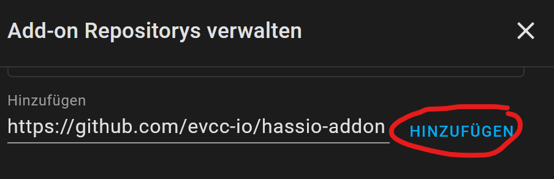
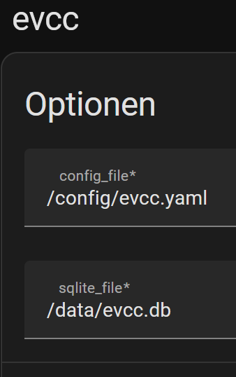

# Energy Assistant-hassio-addon
Energy Assistant Add-on for Home Assistant OS

# Installation

Follow these steps to get the add-on installed on your system:

  - Navigate in your Home Assistant frontend to Supervisor -> Add-on Store.
  
    
  
  - Click -> Add-on Store.
  
    
  
  - Click -> three dots -> Repositories.
   
    
  
  - Click -> three dots -> Repositories.
  
    
  
  - Copy "https://github.com/pail23/energy-assistant-addon" Click -> Add
  
  - Find the "Energy Assistant" add-on and click it.
  - Click on the "INSTALL" button.
  - Go to Information nenu in the "Energy Assistant" Addon and activate "show in side bar"
  - Go to Configuration menu and select your working directory (example):
  
    

        - config_file: /config/Energy Assistant.yaml
        - sqlite_file: /data/Energy Assistant.db
  - Energy Assistant configuration file Energy Assistant.yaml
      - Copy https://github.com/Energy Assistant-io/Energy Assistant/blob/master/Energy Assistant.dist.yaml to your homeassistant config directory
      - Rename  Energy Assistant.dist.yaml to Energy Assistant.yaml (note: configure first to your needs the Energy Assistant.yaml or use a working configuration)
        
        Location of "config" directroy in HA:
        - https://www.home-assistant.io/docs/configuration/
        - https://www.home-assistant.io/common-tasks/os/#installing-and-using-the-samba-add-on

!! NOTE !!

The Home Assistant Addon Energy Assistant is based on docker, there is no possibility to create a configuration file for Energy Assistant inside the Energy Assistant docker with "Energy Assistant configure"!

As a result of this a working Energy Assistant configuration is required. 

To do this, perform the steps in the documentation of Energy Assistant to create a configuration file "Energy Assistant.yaml":

  - https://docs.Energy Assistant.io/docs/installation/manual

# Configuration of [Energy Assistant](https://github.com/Energy Assistant-io/Energy Assistant)

   - https://docs.Energy Assistant.io/docs/guides/setup
